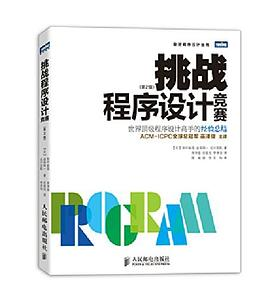
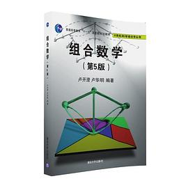

我之前给中学的学弟写了一些博客：https://www.luogu.com.cn/blog/lqs/article-index

但是当时我写的时候还没有看这本书，今天看了目录，发现跟我的想法有异曲同工之妙。（当然人家是世界级选手，比我水平强多了）总之，勾起了我读这本书的兴趣。

---

我觉得搞定算法，就三本书就完事：

要是再多一些，可以参考刘汝佳老师的蓝书和紫书。

再就是kuangbin带你飞系列：https://vjudge.net/article/187