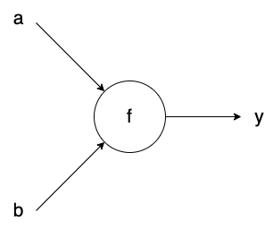

# Pytorch自定义反向传播

在整理[VAE教程](https://github.com/ml-researcher/VAE)的时候发现VQ-VAE里encoder和decoder之间有一个straight-through操作，于是学习了一下Pytorch里自定义反传的写法，在这里做一下整理。

## 计算图

要理解自定义反传，需要先理解计算图这个概念。计算图里每个节点表示一个函数，接受若干个tensor作为输入，输出若干个tensor，这就是前向传播的视角。在反传的视角下，每个函数接受若干个输出对应的梯度，返回若干个输入对应的梯度。

比如上面的图表示了$y=f(a,b)$这一前向传播过程，对于反向传播来说，backward函数接收$\frac{\partial L}{\partial y}$作为输入，返回$\frac{\partial L}{\partial a}$和$\frac{\partial L}{\partial b}$。具体操作的方法是根据链式法则：$\frac{\partial L}{\partial a} = \frac{\partial L}{\partial y}\frac{\partial y}{\partial a}$，$\frac{\partial L}{\partial b} = \frac{\partial L}{\partial y}\frac{\partial y}{\partial b}$。

## torch.autograd.Function

https://github.com/ml-researcher/VAE/blob/master/functions.py